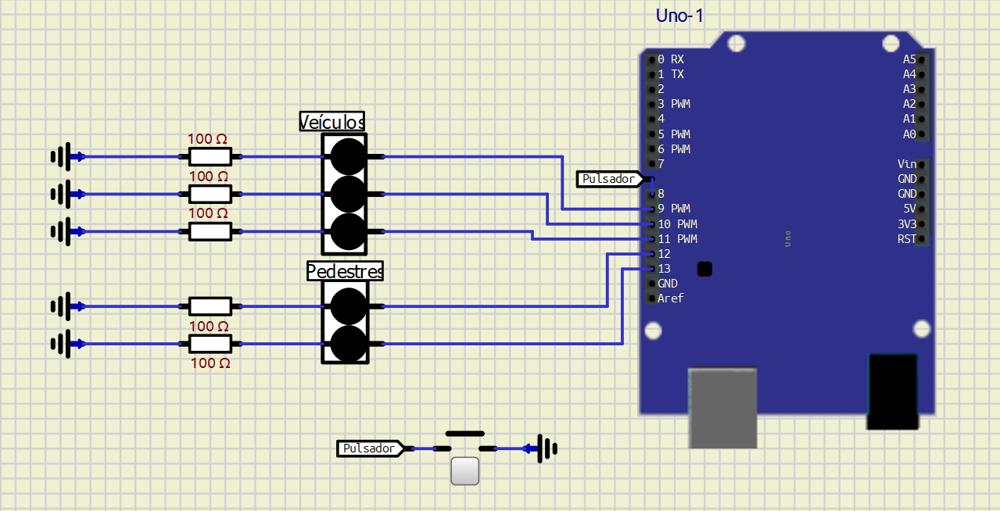

# Semaforo

|:----:|Pino(Arduino Uno)|PORT|
|:----:|:---------------:|:--:|
Verm Veículos|digital pin 9|PB1
Am Veículos|digital pin 10|PB2
Vd Veículos|digital pin 11|PB3
Verm Pedestres|digital pin 12|PB4
Vd Pedestres|digital pin 13|PB5
Botão Pedestres|digital pin 8|PB0
